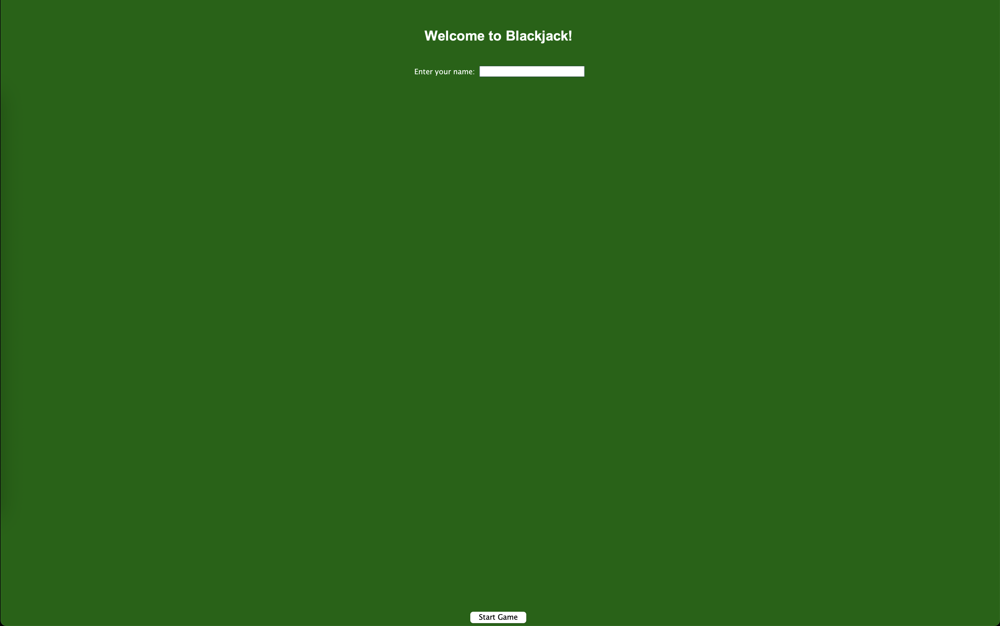
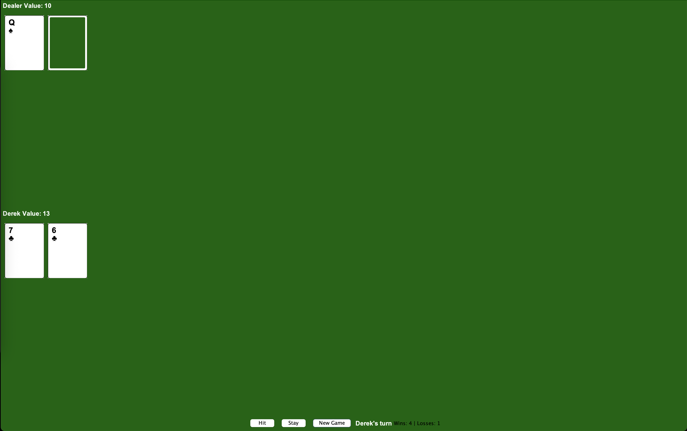

# Blackjack Game

## How to Run

1. Open a terminal in the project directory
2. Compile the Java files:
   ```bash
   javac src/main/java/*.java
   ```
3. Run the game:
   ```bash
   java -cp src/main/java StartScreen
   ```

## Screenshots

### Starting Screen


### Game GUI


## How to Play

1. Enter your name in the start screen
2. Game Rules:
   - Click "Hit" to receive another card
   - Click "Stay" to keep your current hand
   - If your hand value exceeds 21, you bust and lose the round
   - The dealer must hit on soft 17
   - Blackjack (Ace + 10-value card) is an automatic win
   - Ties result in a push
   - Aces can be 1 or 11 (automatically calculated for best hand)
